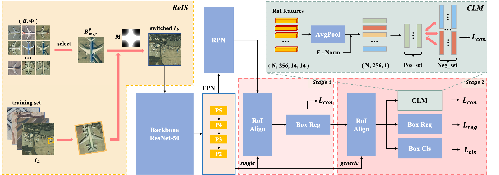

# mmdet-ISCL
This is the official implementation of TGRS paper "Instance Switching-Based Contrastive Learning for Fine-Grained Airplane Detection".[IEEE Xplore](https://ieeexplore.ieee.org/document/9933796)

## Introduction
ISCL is a augmentation method that can be added to most two-stage detectors to boost their performance on fine-grained airplane detection in remote sensing images.

**Abstract**: Detecting airplanes from high-resolution remote sensing images has a variety of applications. The characteristics of clear details, rich spatial, and texture information of objects in high-resolution remote sensing images make it possible to identify different types of airplanes from backgrounds. However, airplanes usually exhibit slight interclass discrepancy and unbalanced class distribution, which pose significant challenges to the fine-grained detection of airplanes. In this article, we propose the ISCL, an instance switching-based contrastive learning method for fine-grained airplane detection. Specifically, we introduce a contrastive learning-based module (CLM) to widen the interclass distance while narrowing the intraclass distance by optimizing feature space distribution with the InfoNCE+ loss, which is built on a serial head in a cascaded way. Then, we design a refined instance switching (ReIS) module to alleviate the class imbalance problem. To take full advantage of the CLM and ReIS, we further introduce an optimization strategy, which is an organic combination of the two modules to widen the distances of different airplane categories that are easily confused. In addition, we contribute a fine-grained attribute-assisted dataset, dubbed GF-RarePlanes dataset (GRD), to help the detectors better learn the subtle differences between the airplanes. Extensive experiments on two datasets (i.e., GF and FAIR1M) demonstrate that our proposed method can significantly improve the accuracy of fine-grained airplane detection under both horizontal bounding box (HBB) and oriented bounding box (OBB) scenarios. Dataset and codes will be available at [https://lanxin1011.github.io/ISCL/](https://lanxin1011.github.io/ISCL/).




## Installation and Get Started

**Required enviroments:** 

Note that this implementation is based on MMDetection v2.18

* Linux
* Python 3.6+
* Pytorch 1.5+
* CUDA 9.2+
* [MMCV](https://mmcv.readthedocs.io/en/latest/#installation)

**Install:**

Note that this repository is based on the [MMDetection](https://github.com/open-mmlab/mmdetection). Assume that your environment has satisfied the above requirements, please follow the following steps for installation.

```shell script
git clone https://github.com/Lanxin1011/mmdet-ISCL.git
pip install -r requirements/build.txt
python setup.py develop
```

**How to run the full code for ISCL in this paper?**

**Step 1.** Download GF or FAIR1M dataset, and of course you can use your own datasets. 

**Step 2.** Select a config file from 'plane_cfg' folder. (Note that 'plane_cfg' has a variety of config files with different configurations, among them 'plane_cfg/GF2/whole_ISCL/config.py' and 'plane_cfg/fair1m/whole_ISCL/config.py' are the config files of the complete ISCL on two datasets.)

**Step 3.** Change the file paths in the following files to the corresponding paths in your directory. *For example, I want to run the full code of ISCL with GF dataset, then I will change the file paths in:* 

```python
1. Config file: plane_cfg/GF2/whole_ISCL/config.py;
2. Refined Instance Switching (ReIS): mmdet/datasets/pipelines/instance_switch2.py
3. Dataset configuration file: mmdet/datasets/plane_serving_is.py
```


## Main Results

Table 1. **HBB** detection results on GF dataset. **Training Set:** GF train-val set, **Validation Set:** GF test set, 120 epochs. 
Method | Backbone | 1 | 2 | 3 | 4 | 5 | 6 | 7 | 8 | 9 | 10 | mAP<sub>50</sub>
--- |:---:|:---:|:---:|:---:|:---:|:---:|:---:|:---:|:---:|:---:|:---:|:---:
Faster R-CNN | R-50 | 33.33 | 54.43 | 9.55 | 32.33 | 32.80 | 38.90 | 57.10 | 57.00 | 60.30 | 37.98 | 54.23
Mask R-CNN | R-50 |31.38|59.88|6.45|28.00|34.72|44.08|59.75|63.20|60.58|40.97|54.28 
Cascade R-CNN | R-50 |28.83|56.90|5.70|28.33|35.23|41.73|57.62|64.20|65.07|40.58|52.98 
DetectoRS | R-50 |34.10|56.62|6.33|32.85|31.70|36.52|54.95|61.93|64.20|39.25|53.08 
Faster R-CNN + ISCL | R-50 |33.65|70.18|19.90|39.48|44.90|55.88|71.60|76.15|66.30|46.98|**62.78 (+8.55)** 


Table 2. **OBB** detection results on GF dataset. **Training Set:** GF train-val set, **Validation Set:** GF test set, 120 epochs. 
Method | Backbone | 1 | 2 | 3 | 4 | 5 | 6 | 7 | 8 | 9 | 10 | mAP<sub>50</sub>
--- |:---:|:---:|:---:|:---:|:---:|:---:|:---:|:---:|:---:|:---:|:---:|:---:
S2A-Net | R-50 |32.70|54.10|5.90|43.20|38.50|55.40|56.40|68.30|60.20|40.40|62.66
S2A-Net + ReIS | R-50 |34.70|62.00|12.70|39.30|40.00|55.00|58.30|70.70|47.60|42.30|**65.51 (+2.85)**
ReDet | ReR-50 |34.40|63.70|11.40|47.30|25.20|63.70|60.20|68.60|68.30|44.80|61.40
ReDet + ISCL | ReR-50 |31.30|72.40|33.90|49.00|38.20|59.80|68.40|71.00|60.40|49.40|**67.21 (+5.81)**
RoI Trans | R-50 |30.20|62.00|16.50|43.90|43.80|58.90|65.60|68.10|60.60|46.90|61.34
RoI Trans + ISCL | R-50 |33.00|68.20|18.70|49.00|40.80|66.70|60.60|63.00|49.90|54.40|**67.76 (+6.42)**
Oriented R-CNN | R-50 |34.10|65.10|19.60|35.20|40.60|50.70|65.90|67.50|60.00|43.90|60.76
Oriented R-CNN + ISCL | R-50 |34.30|75.40|20.40|57.30|44.20|69.70|74.30|81.30|78.30|55.10|**70.54 (+9.78)**

## Visualization
Below are HBB detection visualizations on both GF and FAIR1M datasets. Note that the <font color=green>green</font>, <font color=yellow>yellow</font>, and <font color=red>red boxes</font>, respectively, indicate TP, FP, and FN predictions. (Please refer to the airticle to see more visualization results in OBB tasks.)


## Citation
If you find this work helpful,please consider citing:
```bibtex
@article{zeng2022instance,
  title={Instance Switching-based Contrastive Learning for Fine-grained Airplane Detection},
  author={Zeng, Lanxin and Guo, Haowen and Yang, Wen and Yu, Huai and Yu, Lei and Zhang, Peng and Zou, Tongyuan},
  journal={IEEE Transactions on Geoscience and Remote Sensing},
  year={2022},
  publisher={IEEE}
}
```
